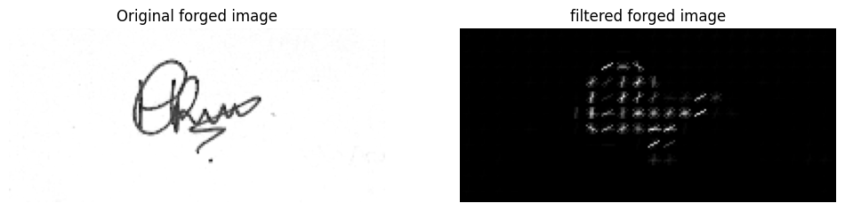

# Signature Verification System

## Summary: 

The developed Signature Verification System adeptly utilizes image processing techniques, 
particularly Histogram of Oriented Gradients (HOG), to achieve a 100% training accuracy in 
discerning between genuine and forged signatures. The meticulously labeled dataset, comprising 
images from a team member, undergoes essential preprocessing steps, highlighting the 
robustness of the chosen methodology. The exclusion of neural networks in favor of a Support 
Vector Machine (SVM) for classification contributes to the system's transparency and 
interpretability. Despite the notable achievements in accuracy, the project acknowledges the 
influence of the dataset size on these results, suggesting a need for further exploration with a 
more extensive and diverse dataset to ensure the model's reliability in practical applications.

## Feature extraction using HOG

Histogram of oriented gradients was used to extract features from an image. 




## Installation and Local Setup Guide

Follow these steps to install and run the project on your local machine:

### 1. Create a Virtual Environment

Create a virtual environment with Python 3.11 using conda or virtualenv.

### 2. Install Dependencies

Install dependencies listed in the `requirements.txt` file using the following command:

```bash
pip install -r requirements.txt
```

### 3. Create a Package of the Project

Create a package of the project by using the following command (ensure you are in the setup.py directory):

```bash
pip install .
```

### 4. Running the Application

Now, use the following command to run the app:

```bash
python app.py
```

The app will likely be hosted at [http://127.0.0.1:5000/](http://127.0.0.1:5000/). Access this URL in your browser, and upload a `.jpg` image to verify if it's forged or genuine.

**Note:** The dataset used for this project is small. You can upload your data in `images/Hgenuine` and `images/Hforged` directories (ensure to upload `.jpg` or `.jpeg` files).

### 5. Custom Model Training

To custom train the model with your own data, use the following command after uploading your custom data in the mentioned directories and make sure to update the directory paths in `src/components/data_transform.py` :

```bash
python src/components/training.py
```

This will create your custom-trained data model in the `artifacts` directory.


## Results
